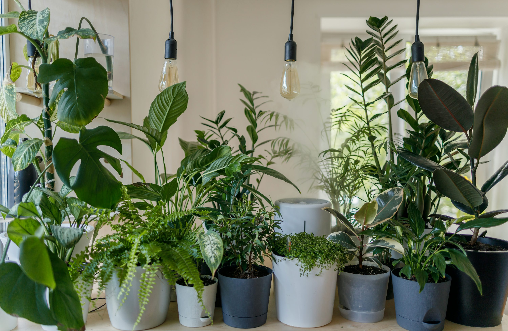

# The Plant-gorithm: Overview

Have you ever had a houseplant die within days of bringing it home, or did you spend a lot of money on a beautiful fern that unknowingly requires watering every other day? Whether you're a seasoned plant collector or a complete beginner, the Plant-gorithm will empower you with the knowledge and expertise to identify and properly care for the plants that are best suited for your lifestyle and home. It's as easy as inputting your preferences and receiving a personalized list of houseplants with their respective care and origin information.

# The Suggestion Algorithm
 
The following variables are used to filter the houseplant dataset, which was sourced from [Kaggle](https://www.kaggle.com/datasets/iottech/plant) and scraped from [Tropicopia Online](https://www.tropicopia.com/).

- Watering Frequency

- Available Sunlight

- Appeal

- Maximum Height

- Availability

# Quick Start Guide:

At this moment, the Dash app can only be hosted locally. To run the app on your device, first clone the GitHub repository and then download it as a ZIP file. The python files can then be run as normal with Visual Studio Code or from the terminal.

# Files Included:

`src/`

- components.py: Defines the structure of the landing and form pages, including Dash core and HTML components.

- data.py: Contains code to read in the plantdata.xlsx Excel file.

- filtering.py: Outlines logic to filter the dataframe according to the user's preferences.

- plantdata.xlsx: The Excel file dowloaded from Kaggle.

`assets/`

- Plants.jpg: first stock image of several houseplants.
- Plants2.jpg: second stock image of several houseplants.

`writeup/`

- DATA440_Writeup.pdf: the final writeup for this project.

main.py: creates the dash app and returns a link to the user interface.

---

